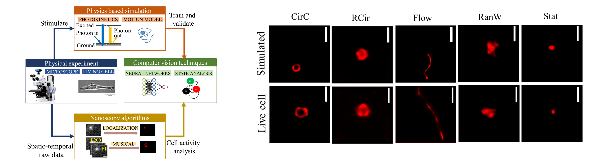

### Publication
Sekh, Arif Ahmed, et al. "Learning nanoscale motion patterns of vesicles in living cells.
" Proceedings of the IEEE/CVF Conference on Computer Vision and Pattern Recognition. 2020. 
[Link to The Paper](https://openaccess.thecvf.com/content_CVPR_2020/html/Sekh_Learning_Nanoscale_Motion_Patterns_of_Vesicles_in_Living_Cells_CVPR_2020_paper.html)

[Project Page](https://nanoscalemotion.github.io/)

### Description
Detecting and analyzing nanoscale motion patterns of vesicles, smaller than the microscope resolution ( 250 nm), inside living biological cells is a challenging problem. 
State-of-the-art CV approaches based on detection, tracking, optical flow or deep learning perform poorly for this problem. We propose an integrative approach, built upon physics based simulations, 
nanoscopy algorithms, and shallow residual attention network to make it possible for the first time to analysis sub-resolution motion patterns in vesicles that may also be of sub-resolution diameter. 
Our results show state-of-the-art performance, 89% validation accuracy on simulated dataset and 82% testing accuracy on an experimental dataset of living heart muscle cells imaged under three 
different pathological conditions. We demonstrate automated analysis of the motion states and changed in them for over 9000 vesicles. Such analysis will enable large scale 
biological studies of vesicle transport and interaction in living cells in the future.

### Introduction
This file contains guideline for running the code for the paper:
Learning nanoscale motion patterns of vesicles in living cells, CVPR 2020

### Requirements
Python=3.6
TesnsorFlow=2.1.0=gpu
Matlab 2019 or Higher
 
### Running the code
Use NanoMotion_V2.0 notebook to train

### License

Copyright © 2021 Sk. Arif Ahmed

The content of this repository is bound by the following licenses:

- The documents and data are licensed under the MIT license.
